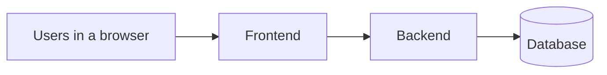
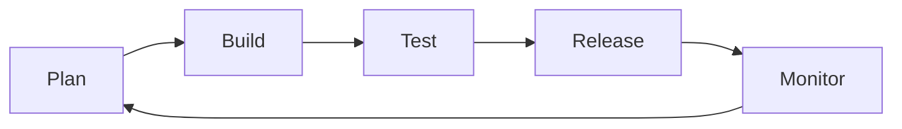

# Containerization with <span class="dm-accent">Docker</span>

<p class="mt-6 text-lg opacity-80"><code>github.com/datamindedacademy/containerization_with_docker</code></p>

---
layout: section
---

# Let's get to know <span class="dm-accent">each other</span>

---
layout: intro
role: Data Engineer, Data Minded
---

# Moenes Ben Soussia

<p class="mt-6 text-lg opacity-80 leading-relaxed">
Started in <strong>software engineering</strong>.<br>
Now a <strong>data engineer</strong>.<br>
Docker is in the toolbox most days.
</p>


---
layout: values
---

# Now you, 30 <span class="dm-accent">seconds</span>

<template #badges>
<DmIconBadge icon="i-mdi-account-outline" label="Name" sub="Who are you?" />
<DmIconBadge icon="i-mdi-briefcase-outline" label="Background" sub="Role" tone="dark" />
<DmIconBadge icon="i-mdi-docker" label="Docker" sub="Never / some / daily" />
</template>

---
layout: agenda
label: Contents
---

# Contents

1. What are containers?
2. The Docker CLI
3. Dev containers
4. Images & registries
5. Writing Dockerfiles
6. Custom builds
7. Containerizing a web application
8. Orchestration
9. CI/CD & wrap-up

<!--
Three blocks, really: what containers are and why they help, the concepts you need to use Docker,
and hands-on practice. Exercises are spread over the whole day, roughly one per section.
-->

---
layout: section
---

# What are <span class="dm-accent">containers</span>?

---
layout: default
label: 1 · Containers
---

# It works on <span class="dm-accent">my machine</span>

<div class="meme-hero">

</div>

<!--
You r dev locally, your application/script is doing all the magic that its supposed to do.
-->

---
layout: default
label: 1 · Containers
---

# All good, <span class="dm-accent">now ship it</span>🚀!

<div class="meme-hero">

</div>

<!--
You are your confidence peak. Lets ship to production. Nothing should break right?
-->

---
layout: default
label: 1 · Containers
---

# Famous last <span class="dm-accent">words</span>

<div class="meme-hero">

</div>

<!--
You get thouands of emails and messages from users.
-->

---
layout: default
label: 1 · Containers
---

# Lost in all the <span class="dm-accent">logs</span>?

<div class="meme-hero">

</div>

<!--
ModuleNotFoundError, JAVA_HOME, PYTHONPATH, wrong numpy. None of these are the app. They are
the machine the app landed on. That is the whole problem.
-->

---
layout: default
label: 1 · Containers
---

# What physical containers are actually <span class="dm-accent">shipping</span>?!

<div class="meme-hero">

</div>

<!--
Step back, when you think about shipping containers, you think about physical containers. But what are they actually shipping?
-->

---
layout: default
label: 1 · Containers
---

# Same box, anywhere it <span class="dm-accent">lands</span>

<div class="meme-hero">

</div>

<!--

-->

---
layout: default
label: 1 · Containers
---

# One box, one <span class="dm-accent">cargo</span>

<div class="meme-hero">

</div>

<!--
YOu dont ship parts of a piano, a car or a laptop. You ship the whole thing. The whole ready to use product.
-->

---
layout: default
label: 1 · Containers
---

# Same idea. For <span class="dm-accent">software</span>.

<div class="meme-hero">

</div>

<!--
Thats the idea. You ship the whole application, but just parts of it, including all dependencies.
-->

---
layout: default
label: 1 · Containers
---

# What is a Docker <span class="dm-accent">container</span>?

<div class="mt-4">

An artifact with **all dependencies needed to run your application**.

</div>

<DmColumns class="mt-6" :gap="16">
<DmColumn tone="plain">

- An operating system (e.g. Linux)
- With the required software installed (Python, Java, …)
- With the required packages installed (Pandas, Numpy, jar files, …)
- Containing the code required to run your application

</DmColumn>
<DmColumn tone="plain" divider>

Building an image gives you almost **full control of the execution environment**.

If the containerized application works on your computer, there is a big chance it will work in any
other environment, production server included.

</DmColumn>
</DmColumns>


---
layout: values
---

# Why containers <span class="dm-accent">win</span>

<template #badges>
<DmIconBadge icon="i-mdi-earth" label="Portability & isolation" sub="Once built, runnable everywhere. Period." />
<DmIconBadge icon="i-mdi-file-code-outline" label="Reproducibility" sub="Runtime & dependencies as code" tone="dark" />
<DmIconBadge icon="i-mdi-feather" label="Lightweight" sub="You ship what you really need" />
</template>

<!--
Reproducibility is the one data engineers feel most: the same image runs on the laptop, in CI, and
on the cluster, so a failure is a real failure and not an environment difference.
-->

---
layout: default
label: 1 · Containers
---

# Dockerfile, image, <span class="dm-accent">container</span>

<p class="mt-1 text-lg">Docker is a tool for creating and running containers.</p>

<div class="docker-flow">
  <div class="docker-flow-node">
    
    <div class="docker-flow-title">Dockerfile</div>
    <div class="docker-flow-sub">A text file: OS, packages, files, the command to run.</div>
  </div>
  <div class="docker-flow-edge">
    <code>docker build<br>-t my-app .</code>
    <div class="i-mdi-arrow-right-bold docker-flow-arrow" />
  </div>
  <div class="docker-flow-node">
    
    <div class="docker-flow-title">Image</div>
    <div class="docker-flow-sub">An immutable prototype. Built once, then shared.</div>
  </div>
  <div class="docker-flow-edge">
    <code>docker run my-app</code>
    <div class="i-mdi-arrow-right-bold docker-flow-arrow" />
  </div>
  <div class="docker-flow-node">
    
    <div class="docker-flow-title">Container</div>
    <div class="docker-flow-sub">A running version of the image. Many from one.</div>
  </div>
</div>

<p class="docker-metaphor">
  <b>Recipe</b>
  <span class="docker-metaphor-arrow">→</span>
  <b>cake mix</b>
  <span class="docker-metaphor-arrow">→</span>
  <b>cake</b>
</p>
<p class="docker-metaphor-note">Those three words come back on every slide from here.</p>


---
layout: section
---

# Get started with <span class="dm-accent">Docker</span>

---
layout: default
label: 2 · The Docker CLI
---

# The Docker <span class="dm-accent">CLI</span>

<p class="mt-2 text-lg">Docker is most often used as a CLI. It manages local images and local containers.</p>

<DmColumns class="mt-6" :gap="16">
<DmColumn header="Manage local images" tone="navy">

```bash
docker image <subcommand> <param>
```

</DmColumn>
<DmColumn header="Manage local containers" tone="violet" divider>

```bash
docker container <subcommand> <param>
```

</DmColumn>
</DmColumns>

<DmBanner tone="authentic" icon="i-mdi-console" title="In practice the main command are omitted" class="mt-6">

- <code>docker build</code> is <code>docker image build</code>
- <code>docker run</code> is <code>docker container run</code>
- <code>docker ps</code> is <code>docker container ls</code>
</DmBanner>

<!--
You have other cli options, but for this course will just use Docker.
Podman, containerd, kaniko...
-->

---
layout: default
label: 2 · The Docker CLI
---

# Running and listing <span class="dm-accent">containers</span>

```bash {all|1-2|4-5|7-8|all}
# Run a container based on a given image
docker container run <options> <image>:<tag> <CMD overwriting>
# Short version
docker run <options> <image>:<tag>

# List the containers currently running (-a: also the stopped ones)
docker container ls -a
# Short version
docker ps -a
```

<DmColumns class="mt-6" :gap="16">
<DmColumn tone="plain">

- `--name` — set the container name
- `--detach` (`-d`) — run in the background

</DmColumn>
<DmColumn tone="plain" divider>

- `--interactive` (`-i`) — plug STDIN into the container
- `--tty` (`-t`) — open a TTY with the container

</DmColumn>
</DmColumns>

---
layout: statement
---

# Exercise 1

<div class="ex-grid ex-grid--single">
<div class="ex-item">
<p class="ex-name">1 · docker CLI</p>
<p class="ex-desc">Basics of the Docker CLI: run your first containers, list them, stop and remove them</p>
<p class="exercise-path"><code>content/exercise_1</code></p>
</div>
</div>

---
layout: default
label: 2 · The Docker CLI
---

# Managing existing <span class="dm-accent">containers</span>

```bash {all|1-2|4-5|7-8|10-11|all}
# Stop / start an existing container
docker container stop|start <container name or id>

# Delete an existing container
docker container rm <container name or id>

# Watch the logs of an existing (and detached) container
docker container logs --follow <container name or id>

# Execute a command inside a running container
docker container exec <container name or id> <command>
```

<DmBanner tone="violet" icon="i-mdi-bug-outline" title="docker exec is your debugger" class="mt-6">
Extremely useful to debug a running Docker container: open a shell inside the running container, look at the filesystem, the environment and the logs from the inside.
</DmBanner>

---
layout: default
label: 2 · The Docker CLI
---

# <span class="dm-accent">exec</span> vs. run --entrypoint

<DmColumns class="mt-4 code-compare">
<DmColumn header="docker exec — existing container" tone="violet">

```bash
docker exec -it looper-cont /bin/bash
```

- Executes a command **against a running container**
- The main purpose (`CMD`) of the container is **still running in parallel**
- Use it to inspect a live container

</DmColumn>
<DmColumn header="docker run --entrypoint — new container" tone="navy" divider>

```bash
docker run --entrypoint=/bin/bash -it looper-cont
```

- Modifies the entrypoint of a **new, to-be-deployed container**
- The main purpose (`CMD`) is **NOT running**
- Use it to poke at an image that crashes on start

</DmColumn>
</DmColumns>

---
layout: default
label: 2 · The Docker CLI
---

# Talking to your container: <span class="dm-accent">-p</span>

<DmColumns class="mt-4 run-flags" :gap="20">
<DmColumn tone="plain" class="col-w1">

<div class="host-box">
<p class="host-label">The machine running Docker (your laptop)</p>
<p class="port-pill">localhost:1994</p>
<div class="container-box mt-3">
<p class="container-label">Docker container</p>
<p class="text-sm mt-1"><code>main.py</code></p>
<p class="port-pill mt-2">port 8080</p>
</div>
</div>

</DmColumn>
<DmColumn tone="plain" divider class="col-w1">

**`--publish` (`-p`)**: map a port on the host to a port inside the container.

```bash
docker run -p <host>:<container> my-image:latest
docker run -p 1994:8080          my-image:latest
docker run -p 8080:8080          my-image:latest
```

Then open `http://localhost:1994/`.

Without `-p`, the container's port exists but nothing on your machine can reach it.

</DmColumn>
</DmColumns>

---
layout: default
label: 2 · The Docker CLI
---

# Sharing files with your container: <span class="dm-accent">-v</span>

<DmColumns class="mt-4 run-flags" :gap="20">
<DmColumn tone="plain" class="col-w1">

<div class="host-box">
<p class="host-label">The machine running Docker</p>
<p class="mount-pill">/path/to/my/config</p>
<div class="container-box mt-3">
<p class="container-label">Docker container</p>
<p class="text-sm mt-1"><code>main.py</code></p>
<p class="mount-pill mt-2">/repo/config</p>
</div>
</div>

</DmColumn>
<DmColumn tone="plain" divider class="col-w1">

**`--volume` (`-v`)**: mount an external volume inside the container.

```bash
docker run -v <host path>:<container path> \
  my-image:latest
docker run -v /path/to/my/config:/repo/config \
  my-image:latest
```

- data inside the container is temporary and deleted when the container is removed.
- Volumes are how data and files survive that.

</DmColumn>
</DmColumns>

---
layout: default
label: 2 · The Docker CLI
---

# Configuring your container: <span class="dm-accent">-e</span>

<DmColumns class="mt-4 run-flags" :gap="20">
<DmColumn tone="plain" class="col-w1">

<div class="host-box">
<p class="host-label">The machine running Docker</p>
<div class="container-box mt-3">
<p class="container-label">Docker container</p>
<p class="env-pill mt-1">ENV="PRO"</p>
<p class="env-pill mt-2">COURSES="ABC,DEF,HIJ"</p>
<p class="text-sm mt-2"><code>main.py</code> reads them from the environment</p>
</div>
</div>

</DmColumn>
<DmColumn tone="plain" divider class="col-w1">

**`--env` (`-e`)**: define environment variables inside the container.

```bash
docker run -e <name>=<value> my-image:latest
docker run -e ENV='PRO' my-image:latest
```

- `--env-file .env` when there are more than a handful

</DmColumn>
</DmColumns>

---
layout: default
label: 2 · The Docker CLI
---

# docker run, all <span class="dm-accent">together</span>

```bash
docker container run <options> <image name>:<tag> <CMD overwriting>
docker run <options> <image name>:<tag> <CMD overwriting>
```

<table class="dm-table dm-table--dense">
<tbody><tr><th style="width: 28%">Option</th><th>What it does</th></tr>
<tr><td><code>--name</code></td><td>Set the container name</td></tr>
<tr><td><code>--detach</code> / <code>-d</code></td><td>Run the container in detached mode</td></tr>
<tr><td><code>--interactive</code> / <code>-i</code></td><td>Plug STDIN inside the container</td></tr>
<tr><td><code>--tty</code> / <code>-t</code></td><td>Open a TTY with the container</td></tr>
<tr><td><code>--entrypoint</code></td><td>Overwrite the Dockerfile <code>ENTRYPOINT</code> clause</td></tr>
<tr><td><code>--publish</code> / <code>-p</code></td><td>Map a host port to a port inside the container</td></tr>
<tr><td><code>--volume</code> / <code>-v</code></td><td>Mount an external volume inside the container</td></tr>
<tr><td><code>--env</code> / <code>-e</code></td><td>Define environment variables inside the container</td></tr>
</tbody></table>

---
layout: statement
---

# Exercises 2 & 3

<div class="ex-grid">
<div class="ex-item">
<p class="ex-name">2 · webserver</p>
<p class="ex-desc">Use an existing image from a registry (nginx) and run a local webserver with port mapping</p>
<p class="exercise-path"><code>content/exercise_2</code></p>
</div>
<div class="ex-item">
<p class="ex-name">3 · interact</p>
<p class="ex-desc">Get inside a running container: <code>exec</code> vs. overwriting the entrypoint</p>
<p class="exercise-path"><code>content/exercise_3</code></p>
</div>
</div>

---
layout: section
---

# Images & <span class="dm-accent">registries</span>


---
layout: default
label: 4 · Images & registries
---

# Dockerfile, <span class="dm-accent">image</span>, container

<p class="mt-1 text-lg">Docker is a tool for creating and running containers.</p>

<div class="docker-flow">
  <div class="docker-flow-node">
    
    <div class="docker-flow-title">Dockerfile</div>
    <div class="docker-flow-sub">A text file: OS, packages, files, the command to run.</div>
  </div>
  <div class="docker-flow-edge">
    <code>docker build<br>-t my-app .</code>
    <div class="i-mdi-arrow-right-bold docker-flow-arrow" />
  </div>
  <div class="docker-flow-node">
    
    <div class="docker-flow-title">Image</div>
    <div class="docker-flow-sub">An immutable prototype. Built once, then shared.</div>
  </div>
  <div class="docker-flow-edge">
    <code>docker run my-app</code>
    <div class="i-mdi-arrow-right-bold docker-flow-arrow" />
  </div>
  <div class="docker-flow-node">
    
    <div class="docker-flow-title">Container</div>
    <div class="docker-flow-sub">A running version of the image. Many from one.</div>
  </div>
</div>

<p class="docker-metaphor">
  <b>Recipe</b>
  <span class="docker-metaphor-arrow">→</span>
  <b>cake mix</b>
  <span class="docker-metaphor-arrow">→</span>
  <b>cake</b>
</p>
<p class="docker-metaphor-note">Those three words come back on every slide from here.</p>

---
layout: default
label: 4 · Images & registries
---

# Working with local <span class="dm-accent">images</span>

```bash {all|1-2|4-5|7-8|10-11|all}
# List all the images available locally
docker image ls                            # docker images

# Build an image from a Dockerfile
docker image build -t <image name> -f <Dockerfile name> <build context>

# Rename / re-tag an existing image
docker image tag <source>:<tag> <target>:<target tag>

# Delete an existing image
docker image rm <image id / complete name>  # docker rmi
```
---
layout: default
label: 4 · Images & registries
---

# Image <span class="dm-accent">registries</span>

<p class="mt-2 text-lg">If Docker images are books, a registry is the library where those books are catalogued and stored.</p>

<DmColumns class="mt-6" :gap="16">
<DmColumn tone="plain">

- Images are **pulled from** and **pushed to** image registries
- Image versioning: images are **immutable objects**

</DmColumn>
<DmColumn tone="plain" divider>

<div class="registry-logos">
  <div class="registry-logo">
    <div class="i-mdi-aws registry-logo-icon registry-logo--aws" />
    <span>ECR</span>
  </div>
  <div class="registry-logo">
    <div class="i-mdi-microsoft-azure registry-logo-icon registry-logo--azure" />
    <span>ACR</span>
  </div>
  <div class="registry-logo">
    <div class="i-mdi-google-cloud registry-logo-icon registry-logo--gcp" />
    <span>GAR</span>
  </div>
  <div class="registry-logo">
    <div class="registry-logo-pair">
      <div class="i-mdi-github registry-logo-icon registry-logo--github" />
      <div class="i-mdi-gitlab registry-logo-icon registry-logo--gitlab" />
    </div>
    <span>GHCR / GitLab</span>
  </div>
  <div class="registry-logo">
    <div class="i-mdi-docker registry-logo-icon registry-logo--docker" />
    <span>Docker Hub</span>
  </div>
  <div class="registry-logo">
    <div class="i-mdi-server registry-logo-icon registry-logo--self" />
    <span>Self-hosted</span>
  </div>
</div>

</DmColumn>
</DmColumns>

<!--
Sharing and collaboration across teams and projects
-->

---
layout: default
label: 4 · Images & registries
---

# Pulling and <span class="dm-accent">pushing</span>

```bash {all|1-2|4-6|all}
# Pull an image from an image registry
docker image pull <registry host>/<image name>:<tag>              # docker pull

# Push a local image to a registry, to share it
# The name must include the remote registry host
docker image push <registry host>/<name>:<tag>   # docker push
```


```bash
docker tag my-app:latest \
  ghcr.io/datamindedacademy/my-app:1.2.0
docker push ghcr.io/datamindedacademy/my-app:1.2.0
```

---
layout: section
---

# Writing <span class="dm-accent">Dockerfiles</span>

---
layout: default
label: 4 · Images & registries
---

# <span class="dm-accent">Dockerfile</span>, image, container

<p class="mt-1 text-lg">Docker is a tool for creating and running containers.</p>

<div class="docker-flow">
  <div class="docker-flow-node">
    
    <div class="docker-flow-title">Dockerfile</div>
    <div class="docker-flow-sub">A text file: OS, packages, files, the command to run.</div>
  </div>
  <div class="docker-flow-edge">
    <code>docker build<br>-t my-app .</code>
    <div class="i-mdi-arrow-right-bold docker-flow-arrow" />
  </div>
  <div class="docker-flow-node">
    
    <div class="docker-flow-title">Image</div>
    <div class="docker-flow-sub">An immutable prototype. Built once, then shared.</div>
  </div>
  <div class="docker-flow-edge">
    <code>docker run my-app</code>
    <div class="i-mdi-arrow-right-bold docker-flow-arrow" />
  </div>
  <div class="docker-flow-node">
    
    <div class="docker-flow-title">Container</div>
    <div class="docker-flow-sub">A running version of the image. Many from one.</div>
  </div>
</div>

<p class="docker-metaphor">
  <b>Recipe</b>
  <span class="docker-metaphor-arrow">→</span>
  <b>cake mix</b>
  <span class="docker-metaphor-arrow">→</span>
  <b>cake</b>
</p>
<p class="docker-metaphor-note">Those three words come back on every slide from here.</p>

---
layout: default
label: 5 · Writing Dockerfiles
---

# A Dockerfile is a <span class="dm-accent">recipe</span>

<p class="mt-2 text-lg">It describes what needs to be run in order to create the desired isolated system.</p>

<DmColumns class="mt-6" :gap="16">
<DmColumn header="Can be very simple" tone="violet">

```dockerfile
FROM python:3.12-slim
COPY main.py .
CMD ["python", "main.py"]
```

</DmColumn>
<DmColumn header="…or very complex" tone="navy" divider>

<div class="complex-df-code">

```dockerfile
FROM python:3.12-slim AS builder
ARG POETRY_VERSION=1.8.3
ENV PIP_DISABLE_PIP_VERSION_CHECK=1 \
    PYTHONDONTWRITEBYTECODE=1
RUN apt-get update && apt-get install -y --no-install-recommends \
        build-essential libpq-dev curl \
    && pip install "poetry==${POETRY_VERSION}" \
    && apt-get clean && rm -rf /var/lib/apt/lists/*
WORKDIR /src
COPY pyproject.toml poetry.lock ./
RUN poetry export -f requirements.txt --output /tmp/req.txt \
    && pip install --prefix=/install -r /tmp/req.txt

FROM python:3.12-slim
RUN apt-get update && apt-get install -y --no-install-recommends \
        libpq5 tini \
    && rm -rf /var/lib/apt/lists/* \
    && useradd --create-home --uid 10001 app
COPY --from=builder /install /usr/local
WORKDIR /app
COPY src/ ./src/
COPY alembic.ini ./
USER app
EXPOSE 8000
HEALTHCHECK --interval=30s --timeout=3s \
    CMD python -c "import urllib.request; urllib.request.urlopen('http://127.0.0.1:8000/health')"
ENTRYPOINT ["tini", "--"]
CMD ["gunicorn", "src.main:app", "--bind", "0.0.0.0:8000"]
```

</div>

</DmColumn>
</DmColumns>

<DmColumns class="mt-6" :gap="16">
<DmColumn tone="plain">

A Dockerfile is made of a **succession of Docker instructions**.

</DmColumn>
<DmColumn tone="plain" divider>

A Dockerfile is **a file part of your repository**, reviewed like any other code.

</DmColumn>
</DmColumns>

---
layout: default
label: 5 · Writing Dockerfiles
---

# The five instructions you <span class="dm-accent">always</span> use

<DmColumns class="mt-4" :gap="20">
<DmColumn tone="plain" class="col-w1">

```dockerfile {1|2|3|4|5|all}
FROM python:3.12-slim
WORKDIR /app
COPY . .
RUN pip install -r requirements.txt
CMD ["python", "main.py"]
```

</DmColumn>
<DmColumn tone="plain" divider class="col-w1">

<ul>
<li><b>FROM</b> — specify a base image</li>
<li v-click="1"><b>WORKDIR</b> — running <code>cd</code> in the Docker world</li>
<li v-click="2"><b>COPY / ADD</b> — copy files inside the container</li>
<li v-click="3"><b>RUN</b> — run a command while building the image</li>
<li v-click="4"><b>CMD</b> — defines the command to run when the container is running</li>
</ul>

</DmColumn>
</DmColumns>

<p class="mt-6 text-sm opacity-70"><code>ADD</code> does the same as COPY. It just works also for remote files. </p>

---
layout: default
label: 5 · Writing Dockerfiles
---

# Every instruction is a <span class="dm-accent">layer</span>

<DmColumns class="mt-4" :gap="24">
<DmColumn tone="plain" class="col-w1">

<div class="layer-stack">
<div class="layer"><span>FROM</span><span class="layer-hash">ytr5e8..</span></div>
<div class="layer"><span>WORKDIR</span><span class="layer-hash">p9isqe..</span></div>
<div class="layer layer--changed"><span>COPY</span><span class="layer-hash">iH9uyt..</span></div>
<div class="layer layer--dirty"><span>RUN</span><span class="layer-hash">2b8ege..</span></div>
<div class="layer layer--dirty"><span>CMD</span><span class="layer-hash">0a1chj..</span></div>
</div>

</DmColumn>
<DmColumn tone="plain" divider class="col-w1">

Each instruction produces a layer with its own hash. A layer is **cached** as long as the layer
below it and its own input are unchanged.

Change something in the `COPY` step, and every layer above it is invalidated and **rebuilt**.

<DmBanner tone="authentic" icon="i-mdi-layers-outline" title="Think wisely about the way you design your layers" class="mt-4">
Order instructions from least to most frequently changing.
</DmBanner>

</DmColumn>
</DmColumns>

---
layout: default
label: 5 · Writing Dockerfiles
---

# Better usage of the <span class="dm-accent">cache</span>

<DmColumns class="mt-4 code-compare">
<DmColumn header="Slow: code and deps in one step" tone="navy">

```dockerfile
FROM python:3.12-slim
WORKDIR /app
COPY . .
RUN pip install -r requirements.txt
CMD ["python", "main.py"]
```

Any change in the code copied in the `COPY` step leads to **re-installing everything** from the
`RUN` steps.

</DmColumn>
<DmColumn header="Fast: dependencies first" tone="violet" divider>

```dockerfile
FROM python:3.12-slim
WORKDIR /app
COPY requirements.txt .
RUN pip install -r requirements.txt
COPY . .
CMD ["python", "main.py"]
```

Requirements change rarely, so the expensive `RUN` layer stays cached across code edits.

</DmColumn>
</DmColumns>

<!--
Check the output of docker build: it prints CACHED in front of every reused layer.
-->
---
layout: default
label: 5 · Writing Dockerfiles
---

# Three more instructions worth <span class="dm-accent">knowing</span>

<DmColumns class="mt-4" :gap="20">
<DmColumn tone="plain" class="col-w1">

```dockerfile
FROM python:3.12-slim
WORKDIR /app
COPY requirements.txt .
RUN pip install -r requirements.txt
COPY . .

EXPOSE 8080
USER appuser
ENTRYPOINT ["python"]
CMD ["main.py"]
```

</DmColumn>
<DmColumn tone="plain" divider class="col-w1">

- **USER** — change the terminal to an existing user.
- **EXPOSE** — declare which port is used by the container.
- **ENTRYPOINT** — defines the executable that runs the `CMD` command.

</DmColumn>
</DmColumns>

<p class="mt-4 text-sm opacity-70"><code>ENTRYPOINT</code> is the program, <code>CMD</code> its default arguments. <code>docker run img foo.py</code> replaces the arguments, not the program.</p>

<!--
When using docker, the user is root by default, dont do that.
Expose, mainly docs
-->

---
layout: default
label: 5 · Writing Dockerfiles
---

# Dockerfile <span class="dm-accent">instructions</span>: the full picture

<DmColumns class="mt-4" :gap="24">
<DmColumn tone="plain" class="col-w1">

<div class="layer-stack">
<div class="layer"><span>FROM</span><span class="layer-hash">ytr5e8..</span></div>
<div class="layer"><span>WORKDIR</span><span class="layer-hash">p9isqe..</span></div>
<div class="layer"><span>COPY</span><span class="layer-hash">iH9uyt..</span></div>
<div class="layer"><span>RUN</span><span class="layer-hash">2b8ege..</span></div>
<div class="layer"><span>CMD</span><span class="layer-hash">0a1chj..</span></div>
</div>

</DmColumn>
<DmColumn tone="plain" divider class="col-w1">

| Instruction | What it does |
| --- | --- |
| `FROM` | Specify a base image |
| `WORKDIR` | Running `cd` in the Docker world |
| `COPY` / `ADD` | Copy files inside the container |
| `RUN` | Run a command while building the image |
| `CMD` | The command run when the container runs |
| `ENTRYPOINT` | The executable that runs the `CMD` |
| `EXPOSE` | Declare the port used by the container |
| `USER` | Change the terminal to an existing user |

</DmColumn>
</DmColumns>

<p class="mt-4 text-center">Design your layers wisely, for speed and for image size.</p>

---
layout: statement
---

# Exercises 4 & 5

<div class="ex-grid">
<div class="ex-item">
<p class="ex-name">4 · streamlit</p>
<p class="ex-desc">Write the Dockerfile of a simple Python application and serve it over a published port</p>
<p class="exercise-path"><code>content/exercise_4</code></p>
</div>
<div class="ex-item">
<p class="ex-name">5 · spring</p>
<p class="ex-desc">Write the Dockerfile of a simple Spring (Java) application: build step, jar, runtime</p>
<p class="exercise-path"><code>content/exercise_5</code></p>
</div>
</div>

---
layout: section
---

# Custom <span class="dm-accent">builds</span>

---
layout: default
label: 6 · Custom builds
---

# Build <span class="dm-accent">arguments</span>

<p class="mt-2">With <code>-e</code>, environment variables can be made available to <b>running</b> containers. But what if external variables are required at <b>build</b> time?</p>

<DmColumns class="mt-6" :gap="20">
<DmColumn tone="plain" class="col-w1">

```dockerfile
ARG PYTHON_VERSION=3.12
FROM python:${PYTHON_VERSION}-slim
```

```bash
docker build --build-arg="PYTHON_VERSION=3.11" .
```

</DmColumn>
<DmColumn tone="plain" divider class="col-w1">

**When to use**: when you want to create different versions of your container from one Dockerfile.

<DmBanner tone="navy" icon="i-mdi-alert-outline" title="Do not use for secrets" class="mt-4">
Build arguments can be retrieved back out of the image via <code>docker image history</code>.
</DmBanner>

</DmColumn>
</DmColumns>

---
layout: default
label: 6 · Custom builds
---

# Build <span class="dm-accent">secrets</span>

<p class="mt-2">Secrets required at build time are exposed through a mount that never lands in a layer.</p>

<DmColumns class="mt-4" :gap="20">
<DmColumn tone="plain" class="col-w1">

```dockerfile
RUN --mount=type=secret,id=pip_token \
    PIP_TOKEN=$(cat /run/secrets/pip_token) \
    pip install --index-url \
      https://$PIP_TOKEN@private.repo/simple my-lib
```

```bash
docker build \
  --secret id=pip_token,env=PIP_TOKEN .
```

</DmColumn>
<DmColumn tone="plain" divider class="col-w1">

- The secret is written to a **file** that is mounted only while that step runs
- It has to be mounted in **every step** that needs it
- Nothing about it is stored in the resulting image

<p class="mt-4 text-sm opacity-70">Adding <code>--progress=plain</code> generates more verbose build logs, useful to debug that the secret was really available at build time.</p>

</DmColumn>
</DmColumns>

---
layout: default
label: 6 · Custom builds
---

# Multi-stage <span class="dm-accent">images</span>

<DmColumns class="mt-4" :gap="20">
<DmColumn tone="plain" class="col-w1">

```dockerfile
FROM python:3.12 AS builder
RUN pip install poetry
COPY pyproject.toml poetry.lock ./
RUN poetry export -o requirements.txt \
 && pip install --prefix=/install \
      -r requirements.txt

FROM python:3.12-slim
COPY --from=builder /install /usr/local
COPY src/ /app
CMD ["python", "/app/main.py"]
```

</DmColumn>
<DmColumn tone="plain" divider class="col-w1">

**The problem**: I use Poetry for local package management, so I want to install packages with
Poetry — but Poetry itself should not be in the final image.

**The solution**:

1. Install the packages using an image that includes Poetry
2. Start a clean stage and copy the installed packages from the first one

`docker build` builds the **last stage** found in the Dockerfile. To stop earlier:
`docker build --target builder .`

</DmColumn>
</DmColumns>

---
layout: section
---

# Containerize a web <span class="dm-accent">application</span>

---
layout: default
label: 7 · Web application
---

# One service = one <span class="dm-accent">container</span>



<DmColumns class="mt-4" :gap="14">
<DmColumn tone="plain">

**Scaling & efficiency** — scale the busy service only

</DmColumn>
<DmColumn tone="plain" divider>

**Re-usability & modularity** — swap one part, keep the rest

</DmColumn>
<DmColumn tone="plain" divider>

**Isolation & security** — a blast radius per service

</DmColumn>
<DmColumn tone="plain" divider>

**Easier to build** — one small Dockerfile per service

</DmColumn>
</DmColumns>

---
layout: default
label: 7 · Web application
---

# Three containers, by <span class="dm-accent">hand</span>

```bash
docker network create app-net
docker run -d --name db   --network app-net -e POSTGRES_PASSWORD=... postgres:16
docker run -d --name api  --network app-net -e DB_HOST=db -p 8000:8000 my-backend
docker run -d --name web  --network app-net -e API_URL=http://api:8000 -p 3000:3000 my-frontend
```

<DmBanner tone="authentic" icon="i-mdi-emoticon-confused-outline" title="This starts getting tedious…" class="mt-6">
…even if we can run in detached mode. Four commands, in the right order, every time, on every
machine — and nothing in the repository records them.
</DmBanner>

<p class="mt-6 text-center text-lg">Can we handle that in a more elegant way?</p>

<!--
Worth naming here: containers on a user-defined network reach each other by container name. That is
why the backend can use `db` as a hostname. Compose creates that network for you.
-->

---
layout: section
---

# Introduce the <span class="dm-accent">orchestration</span>!

---
layout: quote
---

# "Container orchestration is the automation of much of the operational effort required to run containerized workloads: <span class="dm-accent">provisioning, deployment, scaling, networking</span> and load balancing."

---
layout: default
label: 8 · Orchestration
---

# The orchestration <span class="dm-accent">ladder</span>

<p class="mt-2">Different orchestration tools exist in the Docker ecosystem. They differ mainly by their complexity and feature richness.</p>

<div class="ladder">
<div class="ladder-step ladder-step--1">
<h3>Docker Compose</h3>
<p>Single-host based, and not made for production. The developer's tool: one YAML file, one command.</p>
</div>
<div class="ladder-step ladder-step--2">
<h3>Docker Swarm</h3>
<p>Cluster-based. Docker's own scheduler across several machines; largely superseded in practice.</p>
</div>
<div class="ladder-step ladder-step--3">
<h3>Kubernetes (K8s)</h3>
<p>Cluster-based, or serverless. The industry default, and its contenders.</p>
</div>
</div>

<p class="ladder-axis">→ feature richness · production readiness · scalability potential</p>

---
layout: default
label: 8 · Orchestration
---

# docker-compose.yaml, <span class="dm-accent">step by step</span>

<div class="tight-code">

```yaml {all|1|3-8|10-16|18-22|24-25|all}
services:

  database:
    image: postgres:16
    environment:
      - POSTGRES_PASSWORD=${POSTGRES_PASSWORD}
    volumes:
      - pgdata:/var/lib/postgresql/data

  backend:
    build: ./example-backend
    depends_on: [database]
    environment:
      - DB_HOST=database
    ports:
      - "8000:8000"

  frontend:
    build: ./example-frontend
    depends_on: [backend]
    ports:
      - "3000:3000"

volumes:
  pgdata:
```

</div>

<!--
Click order: the services block, then the database (image + env + volume), the backend (build,
depends_on, ports), the frontend, and finally back to `build:` — Compose can build an image from a
Dockerfile as well as pull one.
-->

---
layout: default
label: 8 · Orchestration
---

# Running the whole <span class="dm-accent">stack</span>

<DmColumns class="mt-4" :gap="20">
<DmColumn tone="plain" class="col-w1">

```bash
docker compose up -d      # start everything
docker compose logs -f    # follow all logs
docker compose ps         # what is running
docker compose down -v    # stop and clean volumes
```

</DmColumn>
<DmColumn tone="plain" divider class="col-w1">

- Services reach each other **by service name**: the backend connects to `database`, not to an IP
- `build:` builds from a Dockerfile, `image:` pulls from a registry
- One file in the repository replaces a page of `docker run` commands

</DmColumn>
</DmColumns>

<DmBanner tone="navy" icon="i-mdi-key-off-outline" title="Never hard-code a password in the YAML" class="mt-6">
Use environment variables from the host system instead:
<code>- POSTGRES_PASSWORD=${POSTGRES_PASSWORD}</code>, read from your shell or a
<code>.env</code> file that is git-ignored.
</DmBanner>

---
layout: default
label: 8 · Orchestration
---

# Compose while <span class="dm-accent">developing</span>

<DmColumns class="mt-4" :gap="20">
<DmColumn tone="plain" class="col-w1">

```yaml
  frontend:
    build: ./example-frontend
    volumes:
      - ./example-frontend/src:/app/src
    command: npm run dev
    ports:
      - "3000:3000"
```

</DmColumn>
<DmColumn tone="plain" divider class="col-w1">

When you are working **on** the frontend, mount your source into its container and run the dev
server: edit locally, the container reloads.

The other services keep running as built images, so you develop one service against a realistic
version of all the others.

</DmColumn>
</DmColumns>

---
layout: statement
---

# Exercise 6

<div class="ex-grid ex-grid--single">
<div class="ex-item">
<p class="ex-name">6 · compose</p>
<p class="ex-desc">Run a frontend-backend stack: write the Compose file that wires the services together</p>
<p class="exercise-path"><code>content/exercise_6</code></p>
</div>
</div>

---
layout: section
---

# DevOps in practice: <span class="dm-accent">CI/CD</span>

---
layout: default
label: 9 · CI/CD
---

# The DevOps <span class="dm-accent">loop</span>



<DmColumns class="mt-6" :gap="16">
<DmColumn header="Continuous integration" tone="violet">

Plan → **Build** → **Test**: every change is built and tested automatically, in the same image
your developers use.

</DmColumn>
<DmColumn header="Continuous delivery" tone="navy" divider>

**Release** → **Monitor**: the artifact that passed the tests is the artifact that ships. No
rebuild, no drift.

</DmColumn>
</DmColumns>

<p class="mt-6 text-center">Adapt to change: the CI job runs when a PR is updated, when a branch merges to main, on a tag, …</p>

---
layout: default
label: 9 · CI/CD
---

# Docker in a CI <span class="dm-accent">pipeline</span>

<div class="tight-code">

```yaml {all|1-4|6-11|13-18|19-22|all}
name: build-and-push
on:
  push:
    branches: [main]

jobs:
  build:
    runs-on: ubuntu-latest
    permissions:
      contents: read
      packages: write
    steps:
      - uses: actions/checkout@v4
      - uses: docker/login-action@v3
        with:
          registry: ghcr.io
          username: ${{ github.actor }}
          password: ${{ secrets.GITHUB_TOKEN }}
      - uses: docker/build-push-action@v6
        with:
          push: true
          tags: ghcr.io/${{ github.repository }}:${{ github.sha }}
```

</div>

<!--
Tagging with the commit SHA is the habit worth stealing: every image points back at exactly one
commit, so "what is running in production" always has an answer.
-->

---
layout: statement
---

# Exercise 7

<div class="ex-grid ex-grid--single">
<div class="ex-item">
<p class="ex-name">7 · CI/CD</p>
<p class="ex-desc">Implement a CI/CD pipeline with GitHub Actions and publish the image to the GitHub container registry</p>
<p class="exercise-path"><code>content/exercise_7</code></p>
</div>
</div>

---
layout: section
---

# <span class="dm-accent">Conclusion</span>

---
layout: default
label: 10 · Wrap-up
---

# What we <span class="dm-accent">learned</span>

<p class="mt-2 text-lg">How to work with containers, and how they change the way we approach application development and deployment.</p>

<DmSteps dir="vertical" class="mt-6">
<DmStep :n="1" label="Containers & Docker">

What a container is, how it differs from a VM, and the Dockerfile → image → container triad.

</DmStep>
<DmStep :n="2" label="Docker in practice">

The CLI, ports, volumes and environment variables, writing Dockerfiles, layers and caching, build
args, secrets and multi-stage builds.

</DmStep>
<DmStep :n="3" label="Orchestration & CI/CD">

A first contact with orchestration concepts and with pipelines that build and publish your images.

</DmStep>
</DmSteps>

---
layout: thanks
---

# See you soon for more <span class="dm-accent">adventures</span>!

---
layout: section
---

# <span class="dm-accent">Cheatsheets</span>

---
layout: default
label: Cheatsheet
---

# <span class="dm-accent">docker container</span>

<div class="cheat-grid">
<div class="cheat-item"><b>List running containers (-a: all)</b><code>docker container ls -a  ·  docker ps -a</code></div>
<div class="cheat-item"><b>Run a container from an image</b><code>docker container run &lt;options&gt; &lt;image&gt;:&lt;tag&gt; &lt;CMD&gt;</code></div>
<div class="cheat-item"><b>Stop / start a container</b><code>docker container stop|start &lt;name or id&gt;</code></div>
<div class="cheat-item"><b>Delete a container</b><code>docker container rm &lt;name or id&gt;</code></div>
<div class="cheat-item"><b>Follow the logs</b><code>docker container logs --follow &lt;name or id&gt;</code></div>
<div class="cheat-item"><b>Run a command inside a container</b><code>docker container exec -it &lt;name or id&gt; /bin/bash</code></div>
</div>

<table class="dm-table dm-table--dense mt-4">
<tbody><tr><th style="width: 26%">Option</th><th>What it does</th></tr>
<tr><td><code>--name</code> · <code>-d</code></td><td>Set the container name · run detached</td></tr>
<tr><td><code>-i</code> · <code>-t</code></td><td>Plug STDIN into the container · open a TTY</td></tr>
<tr><td><code>--entrypoint</code></td><td>Overwrite the Dockerfile <code>ENTRYPOINT</code> clause</td></tr>
<tr><td><code>-p</code> · <code>-v</code> · <code>-e</code></td><td>Publish a port · mount a volume · set an environment variable</td></tr>
</tbody></table>

---
layout: default
label: Cheatsheet
---

# <span class="dm-accent">docker image</span>

<div class="cheat-grid">
<div class="cheat-item"><b>List local images</b><code>docker image ls  ·  docker images</code></div>
<div class="cheat-item"><b>Build an image from a Dockerfile</b><code>docker image build -t &lt;name&gt; -f &lt;Dockerfile&gt; .</code></div>
<div class="cheat-item"><b>Rename / re-tag an image</b><code>docker image tag &lt;source&gt;:&lt;tag&gt; &lt;target&gt;:&lt;tag&gt;</code></div>
<div class="cheat-item"><b>Delete an image</b><code>docker image rm &lt;id or name&gt;  ·  docker rmi</code></div>
<div class="cheat-item"><b>Pull an image from a registry</b><code>docker image pull &lt;name&gt;  ·  docker pull</code></div>
<div class="cheat-item"><b>Push an image to a registry</b><code>docker image push &lt;registry&gt;/&lt;name&gt;:&lt;tag&gt;</code></div>
<div class="cheat-item"><b>Inspect how an image was built</b><code>docker image history &lt;name&gt;:&lt;tag&gt;</code></div>
<div class="cheat-item"><b>Reclaim disk space</b><code>docker system prune -a</code></div>
</div>

<table class="dm-table dm-table--dense mt-4">
<tbody><tr><th style="width: 26%">Build option</th><th>What it does</th></tr>
<tr><td><code>-t</code> · <code>-f</code></td><td>Name and tag the image · point at a Dockerfile</td></tr>
<tr><td><code>--build-arg</code></td><td>Pass an <code>ARG</code> into the build (never a secret)</td></tr>
<tr><td><code>--secret</code></td><td>Mount a secret for one build step only</td></tr>
<tr><td><code>--target</code></td><td>Stop at a named stage of a multi-stage build</td></tr>
</tbody></table>

---
layout: default
label: Cheatsheet
---

# <span class="dm-accent">Dockerfile</span> instructions

<DmColumns class="mt-4" :gap="24">
<DmColumn tone="plain" class="col-w1">

```dockerfile
FROM python:3.12-slim
WORKDIR /app
COPY requirements.txt .
RUN pip install -r requirements.txt
COPY src/ .
EXPOSE 8080
USER appuser
ENTRYPOINT ["python"]
CMD ["main.py"]
```

</DmColumn>
<DmColumn tone="plain" divider class="col-w1">

| Instruction | What it does |
| --- | --- |
| `FROM` | Specify a base image |
| `WORKDIR` | Running `cd` in the Docker world |
| `COPY` / `ADD` | Copy files inside the container |
| `RUN` | Run a command while building the image |
| `CMD` | The command run when the container runs |
| `ENTRYPOINT` | The executable that runs the `CMD` |
| `EXPOSE` | Declare the port used by the container |
| `USER` | Change the terminal to an existing user |
| `ARG` | A variable available at build time |

</DmColumn>
</DmColumns>
